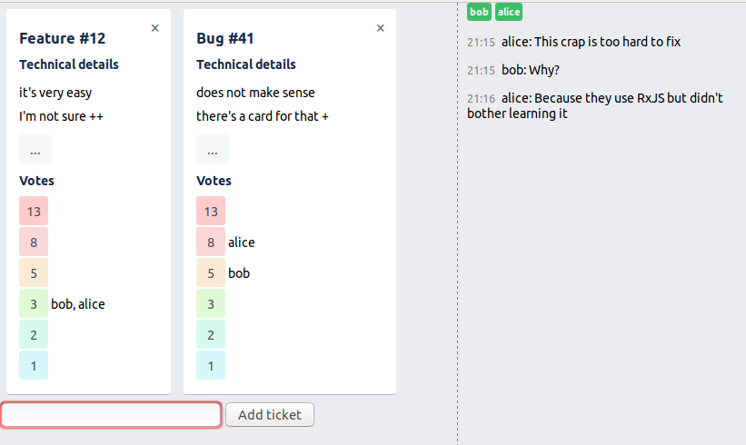

# Grooming Bingo

Grooming Bingo is a tool to make remote "task groomings" easier. Basically it's a voting app (for "points") with a chat.

## Development

The `yarn dev` command will start the JS bundler and the server process in watch mode.
The app should be available at http://localhost:8080.
Use the `PORT` environment variable to override the default port number.
